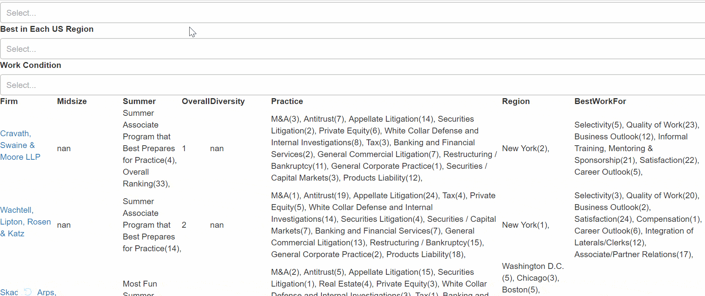

### Top Firm Dash app

This is an app representing the top law firms in US. The UI is implemented with [Dash](https://plot.ly/dash) package from [plotly](https://plot.ly/). This allows you to create an Excel-like dashborad which allows you to quickly apply filters and get results in no time.

The underlying mechanism is a combination of Python Flask and [React](https://facebook.github.io/react/).

Demo:  

.